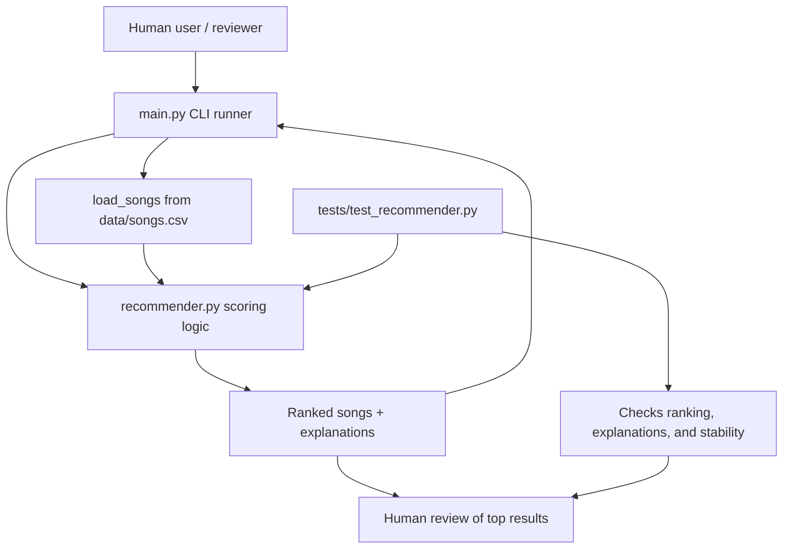

# Music Recommender Simulation

## Title and Summary

**Original project name:** Music Recommender Simulation

This project started as a small, transparent recommender built in Modules 1-3. Its original goal was to show how song metadata and a user taste profile can be turned into ranked recommendations with simple scoring rules. In its current form, it still does that, but it also emphasizes reliability: the system is easy to inspect, easy to test, and easy to explain.

The project matters because it demonstrates the core trade-off in many AI systems: the more transparent the logic is, the easier it is to understand and debug, even if it is less powerful than a large learned model.

## What The System Does

The app loads a small catalog of songs from CSV, compares each song to a user profile, and returns the best matches with a short explanation for each result. It scores genre, mood, energy, acousticness, valence, and danceability, then sorts the full catalog by total score.

## Architecture Overview



The diagram shows a simple pipeline: the CLI runner loads data, the recommender ranks songs, and the test suite checks that the ranking and explanation behavior stay stable. Human review still matters because this is a small AI simulation, not a fully autonomous product.

If you want a presentation-ready image, export the diagram from Mermaid Live Editor and save it in [assets/](assets/).

## Setup Instructions

If you are starting from the repository root, first enter the project folder:

```bash
cd applied-ai-system-final
```

1. Create and activate a virtual environment.

   ```bash
   python -m venv .venv
   source .venv/bin/activate
   ```

2. Install the project dependencies.

   ```bash
   pip install -r requirements.txt
   ```

3. Run the recommender.

   ```bash
   python -m src.main
   ```

4. Run the tests.

   ```bash
   pytest
   ```

5. Run the automated reliability check.

   ```bash
   python scripts/reliability_check.py
   ```

## Sample Interactions

Here are three real example outputs from the current scoring logic.

```text
=== High-Energy Pop ===
1. Sunrise City by Neon Echo
   Score   : 5.33
   Reasons : genre match (+2.00); mood match (+1.00); energy similarity (+1.88); valence tie-break (+0.29); danceability tie-break (+0.16)
2. Gym Hero by Max Pulse
   Score   : 4.35
   Reasons : genre match (+2.00); energy similarity (+1.90); valence tie-break (+0.27); danceability tie-break (+0.18)

=== Chill Lofi ===
1. Library Rain by Paper Lanterns
   Score   : 6.08
   Reasons : genre match (+2.00); mood match (+1.00); energy similarity (+2.00); acoustic preference match (+0.75); valence tie-break (+0.21); danceability tie-break (+0.12)
2. Midnight Coding by LoRoom
   Score   : 5.93
   Reasons : genre match (+2.00); mood match (+1.00); energy similarity (+1.86); acoustic preference match (+0.75); valence tie-break (+0.20); danceability tie-break (+0.12)

=== Deep Intense Rock ===
1. Storm Runner by Voltline
   Score   : 5.28
   Reasons : genre match (+2.00); mood match (+1.00); energy similarity (+1.98); valence tie-break (+0.17); danceability tie-break (+0.13)
2. Gym Hero by Max Pulse
   Score   : 3.43
   Reasons : mood match (+1.00); energy similarity (+1.98); valence tie-break (+0.27); danceability tie-break (+0.18)
```

These examples show that the recommender is functional, explainable, and sensitive to the user profile.

## Design Decisions

I built the system as a transparent rule-based recommender instead of a black-box model. That choice made the logic easy to explain, easy to test, and easy to debug during development. It also fit the size of the dataset: for a small CSV catalog, a weighted scoring system is simpler and more reliable than adding a trained model with no meaningful training data.

The biggest trade-off is accuracy versus interpretability. A rule-based system cannot learn complex preferences the way a real recommendation engine can, and it may overvalue genre matches or miss more subtle signals. In return, it gives clear reasons for every ranking decision, which is valuable for learning, debugging, and portfolio review.

## Testing Summary

The test file [tests/test_recommender.py](tests/test_recommender.py) checks two important behaviors: that recommendations are ranked in the expected order, and that explanation strings are non-empty. I also ran a lightweight reliability check against the live recommender: 5 out of 5 checks passed, including catalog loading, three top-result assertions, and explanation validation.

That reliability check now lives in [scripts/reliability_check.py](scripts/reliability_check.py), so it can be rerun as a command instead of only described in prose. What worked well was the predictability of the scoring function: the same profile consistently returned the same top songs. The main takeaway is that the application logic is straightforward and reproducible, and the scoring code already has simple guardrails because it falls back to safe defaults when optional preference fields are missing.

## Reflection and Ethics

This project showed me that even a small AI system is really a chain of design decisions: what data to use, how to score it, how to explain it, and how to check it. Its main limitations are the tiny catalog, the hand-tuned weights, and the bias toward the features I chose to emphasize, especially genre and energy. Because it does not learn from real user behavior, it can miss nuanced taste and can over-represent songs that fit the scoring rule rather than songs that feel genuinely diverse.

The system could be misused if someone treated it like an objective music ranking engine instead of a classroom demo. I would prevent that by labeling it clearly as a simple simulation, keeping human review in the loop, logging the scores and reasons for each recommendation, and avoiding any high-stakes claims about taste, quality, or preference. The reliability script also helps because it makes the behavior easy to re-check after changes.

What surprised me during testing was how small weight changes could move songs around even when the output still looked reasonable. The results reminded me that an AI system can appear confident while still being shaped by very narrow rules, so tests matter as much as the explanation strings.

My collaboration with AI was useful in two different ways. A helpful suggestion was turning the reliability checks into a reusable script so the system could be tested repeatedly instead of only being inspected by hand. A flawed suggestion was relying too much on assumptions about the environment and setup before I verified them; I had to correct that by checking the actual folder structure and running the code from the real project path.

For a future employer, this project shows that I can build a working AI-style application, document it clearly, and think critically about its limits and responsible use.

## Model Card

For a deeper discussion of strengths, risks, and intended use, see [model_card.md](model_card.md).

